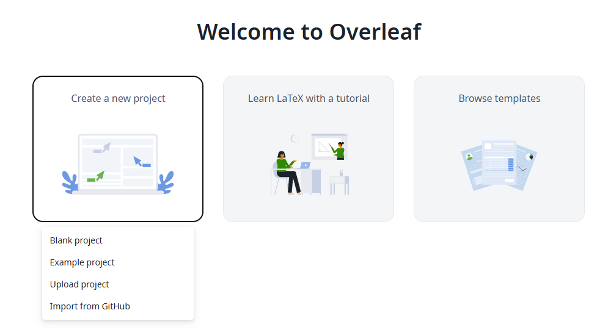
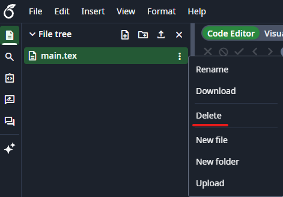
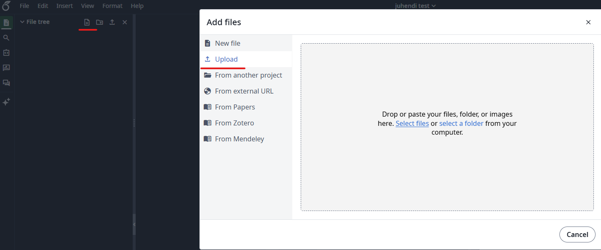
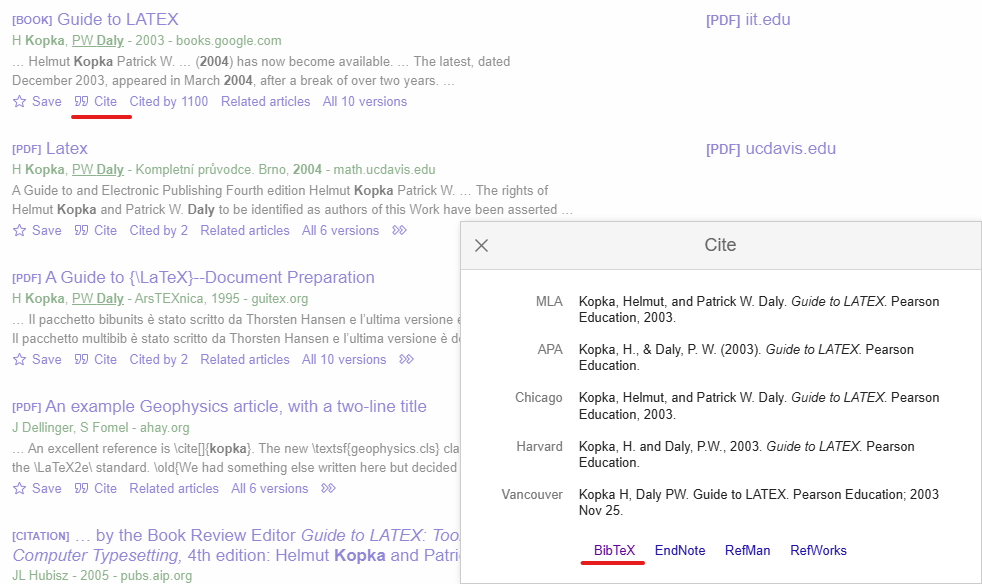

# TLÜ Haapsalu kolledži LaTeXi malli kasutusjuhend

**Autor:** Peeter Alliksaar

**Aasta:** 2026

## Milleks seda LaTeXi malli kasutada?

LaTeX on akadeemiliste kirjalike tööde koostamiseks mõeldud tööriist, mis võtab suurema osa vormistamise mure sinu käest ära. Kui Wordis tuleb leheküljepiirid, pealkirjade stiilid ja sisukord käsitsi paika seada, siis LaTeX teeb seda automaatselt — sina kirjutad sisu, programm hoolitseb väljanägemise eest. Tiitellehe loomiseks piisab vaid mõne muutuja täitmisest (nimi, pealkiri, juhendaja, aasta) ning korrektselt vormindatud tiitelleht tekib iseenesest. Sama kehtib sisukorra kohta — see genereeritakse automaatselt vastavalt sinu peatükkidele ja uueneb iga korraga, kui dokumendi kompileerid. Allikate vormistamine käib samuti automaatselt: sisestad allika andmed kord allikafaili ning LaTeX paigutab tekstisisesed viited ja lõpus asuva allikate loetelu ise õigesse kohta ja õigesse formaati.

## Vajalikud failid

Malli kasutamiseks on vaja vähemalt järgmisi faile:

- `tlu-hk-thesis.cls` – klassifail, mis määrab töö vormistuse;
- `main.tex` – kasutaja enda tööfail;
- `allikad.bib` – allikate fail.

Failid saab tõmmata Haapsalu kolledži Githubi lehelt:

<https://github.com/tluhk/LaTeX-mall>

Algajal kasutajal on soovitatav järgida neid põhimõtteid:

- ära muuda faili `tlu-hk-thesis.cls`;
- ära lisa tavaliselt ise uusi pakette, sest vajalikud vormistuspaketid on klassifailis juba olemas;
- ära kasuta failinimedes tühikuid, täpitähti ega erimärke.

Kasutaja muudab ainult faili `main.tex` ja vajadusel faili `allikad.bib`. Faili `tlu-hk-thesis.cls` tavakasutaja ei muuda, sest selles failis on juba määratud töö vormistus, pealkirjade stiilid, tiitellehe kujundus, tabelite ja jooniste vormistus ning viitamise seaded. Kui seda faili muuta, võib töö vormistus katki minna või ei see vasta enam Haapsalu kolledži kirjalike tööde vormistamise nõuetele.

## Tööfaili alustamine

Töö vormindamiseks on soovitatav kasutada veebikeskkonda Overleaf.

<https://www.overleaf.com>

Sammud:

1. Ava lehekülg <https://www.overleaf.com>.
2. Logi keskkonda sisse või loo uus kasutaja.
3. Loo uus tühi projekt.


4. Pane projektile nimi.
5. kustuta `main.tex`, mis on automaatselt lisatud.


6. Lisa projekti failid, mis GitHubist tõmbasid: `main.tex`, `tlu-hk-thesis.cls`, `allikad.bib`


7. Soovitatav on luua Overleafis ka uus tühi kaust nimega "pildid", kuhu lisada projektis kasutatavaid pilte.
8. Kontrolli, et `main.tex` faili esimene rida oleks `\documentclass{tlu-hk-thesis}`.
9. Vajuta nuppu **Recompile**.
10. Kontrolli tekkinud PDF-faili.
11. Kui sisukord, viited või leheküljenumbrid ei uuene, vajuta **Recompile** veel üks või kaks korda.

## Tiitellehe loomine

Kasutaja ei pea tiitellehte ise käsitsi kujundama. Mall vormistab selle automaatselt.

Tiitellehe andmed kirjutatakse `main.tex` faili algusesse enne käsku `\begin{document}`.

Loogeliste sulgude **{}** vahel olevad muutujad tuleb ära muuta:

```latex
\oppekava{õppekava nimetus}
\autor{Eesnimi Perekonnanimi}
\toopealkiri{Sinu töö pealkiri}
\tooyldnimetus{Rakenduskõrghariduse lõputöö}
\juhendajaandmed{Juhendaja Nimi, kraad}
\teisejuhendajaandmed{Juhendaja Nimi, kraad}
\aasta{2026}
```

Kui teist juhendajat ei ole, tuleb käsk alles jätta tühjade sulgudega:

```latex
\teisejuhendajaandmed{}
```

## Pealkirjad

### Nummerdatud pealkirjad

Mallis on väimalik sisestada kolm pealkirjataset:

```latex
\section{Esimese tasandi pealkiri}
\subsection{Teise tasandi pealkiri}
\subsubsection{Kolmanda tasandi pealkiri}
```

Pealkirju ei vormindata käsitsi paksuks, suureks ega suurte tähtedega. Pealkirjade välimuse määrab mall automaatselt.

Oluline on kirjutada pealkiri õigel kujul. Kuigi esimese tasandi pealkiri kuvatakse töös suurte tähtedega, ilmub see sisukorda nii, nagu kasutaja selle kirjutas.

Soovitatav:

```latex
\section{Malli loomise põhimõtted}
```

Mitte soovitatav:

```latex
\section{MALLI LOOMISE PÕHIMÕTTED}
```

### Nummerdamata pealkirjad

Sissejuhatus, kokkuvõte, ingliskeelne kokkuvõte ja lisad on nummerdamata peatükid. Nende jaoks kasutatakse käsku:

```latex
\unnumberedsection{}
```

Käsk lisab peatüki ka sisukorda. Seda ei pea eraldi käsitsi tegema.

## Lõigud ja uus lehekülg

LaTeX-is ei alustata uut lõiku ainult Enter-klahvi vajutamisega. Uue lõigu alustamiseks tuleb jätta tekstis kahe lõigu vahele üks tühi rida.

Näiteks:

```latex
See on esimene lõik. Siia kirjutatakse ühe mõttega seotud tekst.

See on teine lõik. Kuna kahe tekstiosa vahele on jäetud tühi rida,
alustab LaTeX seda uue lõiguna.
```

Kui tekst kirjutatakse kohe järgmisele reale ilma tühja reata, käsitleb LaTeX seda sama lõigu jätkuna.

Näiteks:

```latex
See on esimene rida.
See on teine rida.
```

LaTeX kuvab selle ühe lõiguna, mitte kahe eraldi lõiguna.

Kui kasutaja soovib alustada teksti uuelt leheküljelt, saab kasutada käsku:

```latex
\newpage
```

See käsk lõpetab aktiivse lehekülje ja alustab sellele järgnevat teksti uuelt leheküljelt.

Näiteks:

```latex
See tekst asub ühel leheküljel.

\newpage

See tekst algab uuelt leheküljelt.
```

Käsku `\newpage` tasub kasutada ainult siis, kui uue lehekülje alustamine on sisuliselt vajalik, näiteks enne suurema osa, lisa või muu eraldi ploki algust.

## Allikate faili koostamine

Kõik allikad lisatakse faili `allikad.bib`. Faili nimi peab olema täpselt `allikad.bib`, sest töö lõpus kasutatakse käsku:

```latex
\bibliography{allikad}
```

Failinimes ei kirjutata `.bib` lõppu käsu sisse.

LaTeX kasutab 14 erinevat BibTeX sisendi tüüpi. Sisendi tüüp on märgitud pärast @-märki. Tüüpilsemad nendest on @article, @book ja @misc. @misc kasutatakse tihti siis kui teised sisendi tüübid ei sobi.

Allikas algab tüübi kirjeldusega (nt @misc), millele järgneb loogelistes sulgudes {} "key" ehk võtmesõnaga. See võtmesõna on see, mida kasutad allikatele viitamisele. See peab olema ainulaadne allikate loetelus.

Lisades allikaid Google Scholari kaudu, siis tuleks kasutada "Cite" nuppu, et saada sealt kätte BibTex-i viitamise formaat. Pilt lisatud järgnevalt.



Tulemus näeb välja selline:

```latex
@book{kopka2003guide,
  title={Guide to LATEX},
  author={Kopka, Helmut and Daly, Patrick W},
  year={2003},
  publisher={Pearson Education}
}
```

Võid allikad koostada ka käsitsi luues @misc sisestusi. Näide:

```latex
@misc{kirjaliketoodejuhend,
  author = {{Tallinna Ulikool Haapsalu kolledz}},
  title = {Üliopilaste kirjalike tooede vormistamise juhend},
  year = 2025,
  note = {[2026, jaanuar 10] \url{https://www.tlu.ee/...}}
}
```

Pärast `@misc`-i kirjuta sellele oma võtmesõna. Autori nime topelt loogeliste sulgudesse lisamisel kuvatakse kogu nimi, vastasel juhul üritab LaTeX sellest lugeda ees- ja perekonnanime. Lisa sellele tiitel ja selle loomise/vaatamise nimi. Lisa sellele "note" kus loogeliste sulgude vahele on kirjutatud kandiliste sulgude vahele vaatamise kuupäev ja veebilehe aadress. Vaata vormistust ülal esitatud näite põhjal.

Allikaid lisa üksteise järele jälgides, et iga allikas lõpeks oma ära oma loogeliste sulgudega.
Allikaid kuvatakse dokumendis alles pärast seda, kui oled neid viitamisel kasutanud.

Mall vormistab allikate pealkirja ja lisab selle sisukorda automaatselt.

## Viitamine

Mall kasutab viitamiseks `natbib` süsteemi. Tavapärane tekstisisene viide lisatakse käsudega:

```latex
\cite{võtmesõna} - Annab autori nime ja sulgudesse lisab aasta arvu
\citep{võtmesõna} - Annab sulgudes autori nime ja aasta arvu
```

Näide:

```latex
See tekst on viidatud \citep{kirjaliketoodejuhend}.
```

Sulgudes olev võtmesõna peab vastama kirjele, mis asub failis `allikad.bib`.

Leheküljenumbriga viide:

```latex
\citep[lk.~18]{kirjaliketoodejuhend}
```

Mitmele allikale viitamine:

```latex
\citep{allikas1,allikas2}
```

## Tabelid

Tabelid lisatakse `table` keskkonnas. Mall vormistab tabeli pealkirja automaatselt tabeli kohale ja nummerdab tabelid ise.

Soovitan tabelite koostamisel kasutada mõnda veebis leiduvat tabelite loojat nagu näiteks

<https://www.tablesgenerator.com/>

Selliste tööriistadega on võimalik mugavamalt ja visuaalselt oma tabel vormistada selliseks, nagu soovid.

Tabelil peab olema pealkiri `\caption{}`  sulgude vahel

Näide tabeli loomisest LaTeXis:

```latex
\begin{table}
\caption{Näidistabel}
\centering
\begin{tabular}{ll}
\textbf{Mõiste} & \textbf{Selgitus} \\
LaTeX & Küldendussüsteem \\
Mall & Valmis vormistuslahendus \\
\end{tabular}
\end{table}
```

Tabelit ei nummerdata käsitsi. Mall lisab numbri ise.

Pikemate tabelite puhul on klassifailis olemas ka `longtable` pakett. Korrektselt vormistatud tabelite jaoks on olemas ka `booktabs` pakett.

## Joonised ja pildid

Pildid on soovitatav panna eraldi kausta `pildid`.

Soovitatavad failiformaadid on:

- `.png`;
- `.jpg`;
- `.pdf`.

Failinimedes tuleks vältida täpitähti, tühikuid ja erimärke.

Soovitatav failinimi: `pildid/joonis1.png`

Mitte soovitatav failinimi: `pildid/minu joonis õäöü.png`

Joonise lisamiseks kasutatakse käsku:

```latex
\joonis{joonise_asukoht/joonise_nimi.faili_laiend}{Joonise nimi \citep{võtmesõna}}
```

Esimestesse sulgudesse kirjutatakse pildifaili asukoht. Teistesse sulgudesse kirjutatakse joonise pealdis. Mall paigutab pealdise õigesse kohta ja vormistab selle automaatselt.

Klassifailis on olemas ka käsk foto lisamiseks:

```latex
\foto{foto_asukoht/foto_nimi.faili_laiend}{Foto nimi \citep{key}}
```

Seda võib kasutada juhul, kui pildi pealdises soovitakse sõna „Foto", mitte „Joonis".

## Koodinäited

Koodinäidete jaoks kasutatakse keskkonda:

```latex
\begin{koodinaide}
...
\end{koodinaide}
```

Koodinäite pealkiri lisatakse pärast koodiplokki käsuga:

```latex
\koodipealkiri{}
```

Näide:

```latex
\begin{koodinaide}
const express = require('express');
const bodyParser = require('body-parser');
const path = require('path');
require('dotenv').config();
const app = express();
const port = 3030;
\end{koodinaide}
\koodipealkiri{naide.js Näide loengust}
```

Kui kasutaja soovib lisada terve faili sisu, võib kasutada käsku:

```latex
\VerbatimInput{naidisfail.js}
```

Sulgudesse kirjutatakse selle faili nimi, mille sisu soovitakse töös kuvada.

## Levinumad probleemid

Kontrolli, et fail oleks salvestatud UTF-8 kodeeringus. Overleafis töötab see tavaliselt automaatselt.

LaTeX kasutab erimärke oma koodi lugemiseks. Selleks, et LaTeX ei loeks järgmist märki oma erimärgiks tuleb selle ette kirjutada `\`-märk. Väga hästi töötab ka käsk `\verb`||, kus püstkriipsude vahel olev tekst kuvatakse otse, ilma muudatusteta.

Kontrolli, et pildifail oleks projektis olemas ja faili tee oleks õige.

```latex
\joonis{joonise_asukoht/joonise_nimi.faili_laiend}{Joonise nimi \citep{võtmesõna}}
```

Kui pilt asub kaustas `pildid`, peab ka failitee algama sõnaga `pildid/`.

Kui viide kuvatakse kujul `?`, kontrolli, et:

- viidatav allikas on failis `allikad.bib`;
- võtmesõna on sama nii tekstis kui ka `.bib` failis;
- oled vajutanud **Recompile** mitu korda.

Vajuta Overleafis **Recompile** üks või kaks korda. LaTeX vajab mõnikord mitut kompileerimist, et sisukord ja leheküljenumbrid õigesti uueneksid.

Kontrolli, et allikate fail oleks nimega `allikad.bib` ja töö lõpus oleks rida:

```latex
\bibliography{allikad}
```

Kontrolli ka, et `.bib` kirjetes oleksid komad ja loogelised sulud õigesti.

Piltide ja failide nimedes tuleks kasutada lihtsaid ladina tähti, numbreid, sidekriipsu või alakriipsu.

Soovitatav: `joonis\_1.png`

Mitte soovitatav: `joonis õpilaste töö.png`

Kui LaTeX annab vea, et klassifaili ei leita, kontrolli, et fail `tlu-hk-thesis.cls` oleks projektis samas kohas, kus asub `main.tex`.

Allikate loetelus tõlgitakse “&“- märk sõnaks “and“. Allikate loetelus vajab märk ära muutmist sõnaks.

## Näide main.tex failist

Alljärgnev näide sobib uue töö alustamiseks.

```latex
\documentclass{tlu-hk-thesis}

% --- TIITELLEHE ANDMED ---
\oppekava{Rakendusinformaatika oppekava}
\autor{Eesnimi Perekonnanimi}
\toopealkiri{Sinu too pealkiri}
\tooyldnimetus{Rakenduskorghariduse loputoo}
\juhendajaandmed{Juhendaja Nimi, kraad}
\teisejuhendajaandmed{}
\aasta{2026}

\maketitlepage
\tableofcontents

\unnumberedsection{Sissejuhatus}

Siin on minu sissejuhatuse tekst.

\section{Esimene peatukk}

Siin on minu esimese peatuki tekst. Viite naide: \citep{kirjaliketoodejuhend}.

\unnumberedsection{Kokkuvote}

Siin on minu kokkuvote.

\bibliography{allikad}

\end{document}
```
